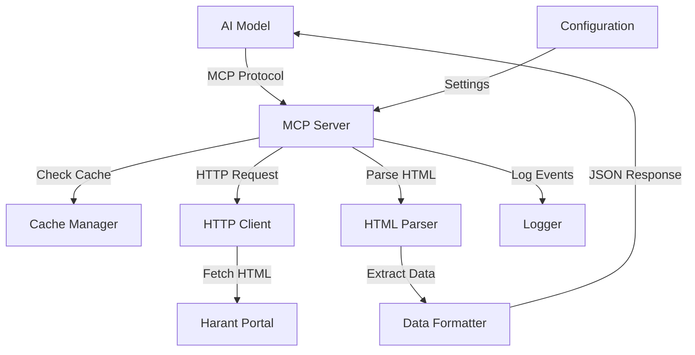

# Technical Design Document

## Overview

Harant MCP Server - это TypeScript/Node.js сервер, реализующий Model Context Protocol (MCP) для интеграции юридического портала Harant (https://harant.ru/) с AI моделями. Сервер предоставляет два основных инструмента: поиск юристов по критериям и получение детальных профилей юристов.

### Key Design Decisions

1. **Язык реализации**: TypeScript/Node.js - стандартный выбор для MCP серверов, обеспечивает типобезопасность и широкую экосистему библиотек
2. **Парсинг HTML**: Cheerio - легковесная и быстрая библиотека для парсинга HTML с jQuery-подобным API
3. **HTTP клиент**: Axios - надежный HTTP клиент с поддержкой таймаутов, повторных попыток и перехватчиков
4. **Кэширование**: In-memory кэш с TTL (node-cache) - простое решение для кэширования с автоматическим истечением
5. **MCP SDK**: @modelcontextprotocol/sdk - официальный SDK для реализации MCP серверов
6. **Логирование**: Winston - гибкая система логирования с поддержкой различных транспортов и уровней

## Architecture

### High-Level Architecture



### Component Interaction Flow

**Поиск юристов:**
1. AI модель отправляет запрос через MCP протокол с параметрами поиска
2. MCP Server валидирует параметры запроса
3. HTTP Client формирует URL поиска и отправляет запрос к Harant Portal
4. HTML Parser извлекает список юристов из HTML страницы результатов
5. Data Formatter преобразует данные в JSON формат MCP
6. Результат возвращается AI модели

**Получение профиля:**
1. AI модель запрашивает профиль по URL
2. Cache Manager проверяет наличие данных в кэше
3. Если данных нет или они устарели, HTTP Client запрашивает страницу профиля
4. HTML Parser извлекает структурированные данные профиля
5. Data Formatter преобразует данные в JSON
6. Cache Manager сохраняет данные в кэш
7. Результат возвращается AI модели

## Components and Interfaces

### 1. MCP Server Core

**Responsibility**: Реализация MCP протокола, регистрация инструментов, маршрутизация запросов

```typescript
interface MCPServer {
  initialize(): Promise<void>;
  registerTools(): void;
  handleToolCall(toolName: string, args: unknown): Promise<ToolResult>;
  shutdown(): Promise<void>;
}

interface ToolResult {
  content: Array<{
    type: "text";
    text: string;
  }>;
  isError?: boolean;
}
```

**Key Methods:**
- `initialize()`: Инициализация сервера, загрузка конфигурации, подключение к MCP транспорту
- `registerTools()`: Регистрация доступных инструментов (search_lawyers, get_lawyer_profile)
- `handleToolCall()`: Обработка вызовов инструментов от AI моделей
- `shutdown()`: Корректное завершение работы сервера

### 2. HTTP Client

**Responsibility**: Выполнение HTTP запросов к Harant Portal с обработкой ошибок и повторными попытками

```typescript
interface HTTPClient {
  get(url: string, options?: RequestOptions): Promise<string>;
  setDefaultTimeout(ms: number): void;
  setRetryPolicy(policy: RetryPolicy): void;
}

interface RequestOptions {
  timeout?: number;
  headers?: Record<string, string>;
}

interface RetryPolicy {
  maxRetries: number;
  backoffMultiplier: number;
  initialDelayMs: number;
}
```

**Features:**
- Автоматические повторные попытки при сетевых ошибках (до 3 раз)
- Экспоненциальная задержка между попытками
- Таймаут запросов (по умолчанию 30 секунд)
- Обработка кириллических символов в URL и ответах

### 3. HTML Parser

**Responsibility**: Извлечение структурированных данных из HTML страниц Harant Portal

```typescript
interface HTMLParser {
  parseSearchResults(html: string): LawyerSearchResult[];
  parseLawyerProfile(html: string): LawyerProfile;
  validateStructure(html: string, expectedSelectors: string[]): ValidationResult;
}

interface LawyerSearchResult {
  name: string;
  city: string;
  specialization: string;
  profileUrl: string;
  rating?: number;
}

interface LawyerProfile {
  name: string;
  city: string;
  specialization: string[];
  experience: string;
  contacts: ContactInfo;
  rating?: number;
  description?: string;
}

interface ContactInfo {
  phone?: string;
  email?: string;
  website?: string;
}

interface ValidationResult {
  isValid: boolean;
  missingSelectors: string[];
  warnings: string[];
}
```

**Parsing Strategy:**
- Использование CSS селекторов для извлечения данных
- Нормализация текста (удаление лишних пробелов, trim)
- Валидация обязательных полей
- Логирование предупреждений при изменении структуры страницы

### 4. Cache Manager

**Responsibility**: Кэширование данных профилей для снижения нагрузки на портал

```typescript
interface CacheManager {
  get(key: string): Promise<LawyerProfile | null>;
  set(key: string, value: LawyerProfile, ttlSeconds: number): Promise<void>;
  has(key: string): Promise<boolean>;
  clear(): Promise<void>;
  getStats(): CacheStats;
}

interface CacheStats {
  hits: number;
  misses: number;
  size: number;
  hitRate: number;
}
```

**Configuration:**
- TTL по умолчанию: 24 часа (86400 секунд)
- Ключ кэша: Profile_URL
- Максимальный размер кэша: 1000 записей
- Стратегия вытеснения: LRU (Least Recently Used)

### 5. Data Formatter

**Responsibility**: Преобразование данных в JSON формат, соответствующий MCP спецификации

```typescript
interface DataFormatter {
  formatSearchResults(results: LawyerSearchResult[]): string;
  formatLawyerProfile(profile: LawyerProfile): string;
  formatError(error: Error, context: ErrorContext): string;
}

interface ErrorContext {
  operation: string;
  url?: string;
  timestamp: Date;
}

interface FormattedResponse {
  data: unknown;
  metadata: ResponseMetadata;
}

interface ResponseMetadata {
  timestamp: string;
  source: string;
  cached: boolean;
}
```

**Formatting Rules:**
- Экранирование специальных символов для JSON
- Включение метаданных (timestamp, source, cached)
- Форматирование ошибок с описательными сообщениями
- Валидация JSON схемы перед возвратом

### 6. Configuration Manager

**Responsibility**: Загрузка и валидация конфигурации сервера

```typescript
interface ConfigurationManager {
  load(path?: string): Promise<ServerConfig>;
  validate(config: ServerConfig): ValidationResult;
  getDefaults(): ServerConfig;
}

interface ServerConfig {
  harant: {
    baseUrl: string;
    searchPath: string;
    profilePath: string;
  };
  http: {
    timeout: number;
    maxRetries: number;
    retryDelay: number;
  };
  cache: {
    enabled: boolean;
    ttl: number;
    maxSize: number;
  };
  logging: {
    level: LogLevel;
    file: string;
    console: boolean;
  };
}

type LogLevel = "DEBUG" | "INFO" | "WARNING" | "ERROR" | "CRITICAL";
```

**Default Configuration:**
```json
{
  "harant": {
    "baseUrl": "https://harant.ru",
    "searchPath": "/lawyers/search",
    "profilePath": "/lawyers/profile"
  },
  "http": {
    "timeout": 30000,
    "maxRetries": 3,
    "retryDelay": 1000
  },
  "cache": {
    "enabled": true,
    "ttl": 86400,
    "maxSize": 1000
  },
  "logging": {
    "level": "INFO",
    "file": "harant-mcp.log",
    "console": true
  }
}
```

### 7. Logger

**Responsibility**: Логирование событий, ошибок и метрик производительности

```typescript
interface Logger {
  debug(message: string, meta?: LogMetadata): void;
  info(message: string, meta?: LogMetadata): void;
  warning(message: string, meta?: LogMetadata): void;
  error(message: string, error: Error, meta?: LogMetadata): void;
  critical(message: string, error: Error, meta?: LogMetadata): void;
}

interface LogMetadata {
  operation?: string;
  duration?: number;
  url?: string;
  [key: string]: unknown;
}
```

**Logging Strategy:**
- Все входящие запросы логируются на уровне INFO
- Время выполнения > 5 секунд - WARNING
- Сетевые ошибки - ERROR с stack trace
- Критические ошибки - CRITICAL с полным контекстом
- Ротация логов при достижении 10MB

## Data Models

### Core Data Structures

```typescript
// Lawyer search result from search page
interface LawyerSearchResult {
  name: string;              // Полное имя юриста
  city: string;              // Город практики
  specialization: string;    // Основная специализация
  profileUrl: string;        // URL профиля на Harant
  rating?: number;           // Рейтинг (если доступен)
}

// Complete lawyer profile
interface LawyerProfile {
  name: string;                    // Полное имя
  city: string;                    // Город
  specialization: string[];        // Список специализаций
  experience: string;              // Опыт работы (текстовое описание)
  contacts: ContactInfo;           // Контактная информация
  rating?: number;                 // Рейтинг
  description?: string;            // Описание профиля
  education?: string[];            // Образование
  languages?: string[];            // Языки
  achievements?: string[];         // Достижения
}

// Contact information
interface ContactInfo {
  phone?: string;      // Телефон
  email?: string;      // Email
  website?: string;    // Веб-сайт
  telegram?: string;   // Telegram
}

// MCP Tool definitions
interface SearchLawyersTool {
  name: "search_lawyers";
  description: "Поиск юристов на портале Harant по различным критериям";
  inputSchema: {
    type: "object";
    properties: {
      city?: string;           // Город для поиска
      specialization?: string; // Специализация
      name?: string;           // Имя юриста
    };
  };
}

interface GetLawyerProfileTool {
  name: "get_lawyer_profile";
  description: "Получение детального профиля юриста по URL";
  inputSchema: {
    type: "object";
    properties: {
      profileUrl: string;  // URL профиля на Harant (обязательный)
    };
    required: ["profileUrl"];
  };
}
```

### Error Types

```typescript
enum ErrorType {
  NETWORK_ERROR = "NETWORK_ERROR",           // Сетевая ошибка
  TIMEOUT_ERROR = "TIMEOUT_ERROR",           // Таймаут запроса
  PARSE_ERROR = "PARSE_ERROR",               // Ошибка парсинга HTML
  VALIDATION_ERROR = "VALIDATION_ERROR",     // Ошибка валидации данных
  NOT_FOUND_ERROR = "NOT_FOUND_ERROR",       // Профиль не найден (404)
  CONFIG_ERROR = "CONFIG_ERROR",             // Ошибка конфигурации
  CACHE_ERROR = "CACHE_ERROR"                // Ошибка кэша
}

interface MCPError {
  type: ErrorType;
  message: string;
  details?: string;
  timestamp: Date;
  retryable: boolean;
}
```

## Correctness Properties

*A property is a characteristic or behavior that should hold true across all valid executions of a system—essentially, a formal statement about what the system should do. Properties serve as the bridge between human-readable specifications and machine-verifiable correctness guarantees.*

### Property-Based Testing Applicability Assessment

This MCP server involves significant external dependencies (web scraping, HTTP requests, HTML parsing from a live website). Let me analyze which components are suitable for property-based testing:

**Suitable for PBT:**
- Data Formatter (JSON serialization/deserialization)
- Configuration validation
- URL validation and formatting
- Data structure transformations

**NOT suitable for PBT:**
- HTTP requests to external portal (external dependency)
- HTML parsing (depends on external HTML structure)
- Cache operations (stateful, side-effect heavy)
- MCP protocol integration (integration testing more appropriate)

Given this analysis, I will use the prework tool to analyze acceptance criteria and identify which can be tested with properties.


### Property Reflection

After analyzing all acceptance criteria, I identified the following properties suitable for property-based testing:

**Identified Properties:**
1. Invalid parameter validation (1.5)
2. LawyerProfile required fields validation (2.2)
3. Invalid URL validation (2.4)
4. Cyrillic text handling (3.2)
5. Missing required field error handling (3.5)
6. JSON special character escaping (4.3)
7. JSON serialization round-trip (4.5)
8. Cache key generation from URLs (7.4)
9. Configuration required parameters validation (8.2)
10. Invalid configuration value validation (8.4)

**Redundancy Analysis:**
- Properties 1, 2.4, 8.4 all test validation logic with invalid inputs - these can be consolidated into validation properties
- Property 2.2 (required fields) and 3.5 (missing fields) test similar concepts but at different layers (data structure vs parsing)
- Properties 4.3 and 4.5 both test JSON formatting, but 4.5 (round-trip) is more comprehensive and subsumes 4.3 if the round-trip includes special characters

**Consolidated Properties:**
1. **Input validation property**: Covers invalid parameters (1.5), invalid URLs (2.4), invalid config (8.4)
2. **Data structure validation property**: Required fields in LawyerProfile (2.2)
3. **Cyrillic text preservation property**: Text encoding handling (3.2)
4. **Parser error reporting property**: Missing required fields (3.5)
5. **JSON round-trip property**: Serialization/deserialization (4.5) - subsumes special character handling (4.3)
6. **Cache key generation property**: URL to cache key mapping (7.4)
7. **Configuration validation property**: Required config parameters (8.2)

After reflection, I will implement 7 distinct properties that provide unique validation value without redundancy.

### Property 1: Input Validation Produces Descriptive Errors

*For any* invalid input (malformed URL, missing required parameters, invalid parameter values), the validation logic SHALL return a descriptive error message that identifies the specific validation failure.

**Validates: Requirements 1.5, 2.4, 8.4**

### Property 2: LawyerProfile Contains Required Fields

*For any* valid LawyerProfile object, it SHALL contain all required fields: name, city, specialization (non-empty array), experience, and contacts object.

**Validates: Requirements 2.2**

### Property 3: Cyrillic Text Preservation

*For any* string containing Cyrillic characters, when processed through the HTML parser and data formatter, the output SHALL preserve all Cyrillic characters without corruption or encoding errors.

**Validates: Requirements 3.2**

### Property 4: Parser Reports Missing Required Fields

*For any* HTML document missing one or more required fields (name, city, specialization), the parser SHALL return an error that explicitly identifies which required field is missing.

**Validates: Requirements 3.5**

### Property 5: JSON Serialization Round-Trip

*For any* valid LawyerProfile object, serializing to JSON and then deserializing back SHALL produce an equivalent object with all fields preserved, including special characters and Cyrillic text.

**Validates: Requirements 4.5, 4.3**

### Property 6: Cache Key Generation from URL

*For any* valid profile URL, the cache manager SHALL generate a consistent cache key such that the same URL always produces the same cache key, and different URLs produce different cache keys.

**Validates: Requirements 7.4**

### Property 7: Configuration Validation Completeness

*For any* ServerConfig object, the validator SHALL verify that all required configuration sections (harant, http, cache, logging) are present and contain their required parameters before the configuration is applied.

**Validates: Requirements 8.2**

## Error Handling

### Error Handling Strategy

The server implements a layered error handling approach:

1. **Input Validation Layer**: Validates all inputs before processing
2. **Network Layer**: Handles HTTP errors, timeouts, and retries
3. **Parsing Layer**: Handles HTML structure changes and missing data
4. **Application Layer**: Handles business logic errors
5. **MCP Protocol Layer**: Formats errors according to MCP specification

### Error Categories and Handling

#### 1. Network Errors

**Scenarios:**
- Connection refused
- DNS resolution failure
- SSL/TLS errors
- Network timeout

**Handling:**
- Retry up to 3 times with exponential backoff (1s, 2s, 4s)
- Log each retry attempt
- Return descriptive error after final failure
- Include retry-after suggestion in error message

**Example Error:**
```json
{
  "type": "NETWORK_ERROR",
  "message": "Не удалось подключиться к порталу Harant",
  "details": "Connection refused after 3 attempts",
  "retryable": true,
  "retryAfter": "30s"
}
```

#### 2. Timeout Errors

**Scenarios:**
- Request exceeds 30-second timeout
- Slow network connection
- Portal server overload

**Handling:**
- Cancel request immediately at timeout
- No retries for timeout (already waited maximum time)
- Log timeout with request details
- Suggest checking portal availability

**Example Error:**
```json
{
  "type": "TIMEOUT_ERROR",
  "message": "Запрос превысил максимальное время ожидания",
  "details": "Request to https://harant.ru/lawyers/profile/123 timed out after 30s",
  "retryable": false
}
```

#### 3. Parsing Errors

**Scenarios:**
- HTML structure changed
- Required selector not found
- Invalid data format
- Missing required fields

**Handling:**
- Log warning for structure changes
- Return specific error for missing fields
- Include HTML snippet in debug logs
- Suggest manual verification of portal

**Example Error:**
```json
{
  "type": "PARSE_ERROR",
  "message": "Не удалось извлечь данные профиля",
  "details": "Required field 'name' not found in HTML",
  "missingSelectors": [".lawyer-name"],
  "retryable": false
}
```

#### 4. Validation Errors

**Scenarios:**
- Invalid URL format
- Missing required parameters
- Invalid parameter values
- Invalid configuration

**Handling:**
- Validate before making external requests
- Return specific validation error
- Include parameter name and expected format
- No retries (input must be corrected)

**Example Error:**
```json
{
  "type": "VALIDATION_ERROR",
  "message": "Некорректный формат URL профиля",
  "details": "profileUrl must be a valid URL starting with https://harant.ru/",
  "parameter": "profileUrl",
  "providedValue": "invalid-url",
  "retryable": false
}
```

#### 5. Not Found Errors (404)

**Scenarios:**
- Profile URL points to non-existent profile
- Lawyer removed from portal
- Incorrect URL

**Handling:**
- Return 404-specific error
- Suggest verifying URL
- No retries
- Cache negative result briefly (5 minutes)

**Example Error:**
```json
{
  "type": "NOT_FOUND_ERROR",
  "message": "Профиль юриста не найден",
  "details": "The profile at https://harant.ru/lawyers/profile/123 does not exist",
  "statusCode": 404,
  "retryable": false
}
```

#### 6. Configuration Errors

**Scenarios:**
- Missing configuration file
- Invalid configuration values
- Missing required parameters

**Handling:**
- Validate configuration at startup
- Use defaults for missing optional parameters
- Fail fast for invalid required parameters
- Log configuration errors at CRITICAL level

**Example Error:**
```json
{
  "type": "CONFIG_ERROR",
  "message": "Некорректная конфигурация сервера",
  "details": "http.timeout must be a positive number, got: -1",
  "parameter": "http.timeout",
  "retryable": false
}
```

### Error Recovery Strategies

1. **Graceful Degradation**: Server continues operating after non-critical errors
2. **Circuit Breaker**: Temporarily stop requests to portal after repeated failures
3. **Fallback to Cache**: Return cached data with warning if portal unavailable
4. **Partial Results**: Return available data even if some fields are missing (with warnings)

### Logging Requirements

All errors must be logged with:
- Timestamp (ISO 8601 format)
- Error type and message
- Stack trace (for unexpected errors)
- Request context (URL, parameters)
- User-facing error message
- Internal error details

## Testing Strategy

### Testing Approach

This MCP server involves significant integration with external services (Harant portal), making a hybrid testing approach necessary:

1. **Unit Tests**: Test pure logic components (validation, formatting, configuration)
2. **Property-Based Tests**: Test universal properties across input ranges (7 properties identified)
3. **Integration Tests**: Test external dependencies with mocks and real endpoints
4. **End-to-End Tests**: Test complete workflows with MCP clients

### Property-Based Testing

**Library**: fast-check (TypeScript property-based testing library)

**Configuration**:
- Minimum 100 iterations per property test
- Each test tagged with feature name and property number
- Custom generators for domain-specific types (URLs, Cyrillic text, LawyerProfile)

**Property Test Implementation Requirements**:

Each correctness property SHALL be implemented as a single property-based test with the following tag format:

```typescript
// Feature: harant-mcp-server, Property 1: Input Validation Produces Descriptive Errors
test('invalid inputs produce descriptive errors', () => {
  fc.assert(
    fc.property(
      fc.oneof(
        invalidUrlGenerator(),
        invalidParametersGenerator(),
        invalidConfigGenerator()
      ),
      (invalidInput) => {
        const result = validate(invalidInput);
        expect(result.isError).toBe(true);
        expect(result.message).toBeTruthy();
        expect(result.message.length).toBeGreaterThan(10);
      }
    ),
    { numRuns: 100 }
  );
});
```

**Custom Generators**:

```typescript
// Generate invalid URLs
const invalidUrlGenerator = () => fc.oneof(
  fc.constant(''),
  fc.constant('not-a-url'),
  fc.string().filter(s => !s.startsWith('http')),
  fc.constant('http://wrong-domain.com/profile/123')
);

// Generate Cyrillic text
const cyrillicTextGenerator = () => fc.stringOf(
  fc.integer(0x0400, 0x04FF).map(code => String.fromCharCode(code))
);

// Generate valid LawyerProfile objects
const lawyerProfileGenerator = () => fc.record({
  name: fc.string({ minLength: 1 }),
  city: fc.string({ minLength: 1 }),
  specialization: fc.array(fc.string({ minLength: 1 }), { minLength: 1 }),
  experience: fc.string(),
  contacts: fc.record({
    phone: fc.option(fc.string()),
    email: fc.option(fc.string()),
    website: fc.option(fc.string())
  })
});
```

### Unit Testing

**Focus Areas**:
- Input validation logic
- Data formatting and transformation
- Configuration parsing and validation
- Error message generation
- Cache key generation
- URL construction

**Example Unit Tests**:
- Empty search results return empty array
- 404 response produces NOT_FOUND_ERROR
- Missing config file loads defaults
- Invalid config values produce validation errors
- Timeout triggers after 30 seconds
- Retry logic executes 3 times with exponential backoff

### Integration Testing

**Focus Areas**:
- HTTP client integration with Harant portal
- HTML parsing with real portal HTML
- MCP protocol compliance
- Cache integration
- Logging integration

**Test Strategy**:
- Use recorded HTTP responses for deterministic tests
- Test with 2-3 real profile URLs (with permission)
- Mock HTTP client for error scenarios
- Verify MCP protocol with official MCP test suite

**Example Integration Tests**:
- Search lawyers by city returns results from portal
- Get lawyer profile extracts all fields correctly
- MCP tools/list returns correct tool definitions
- Cache stores and retrieves profiles correctly
- Logger writes to both file and console

### End-to-End Testing

**Test Scenarios**:
1. Complete search workflow: AI model → MCP → Portal → Parse → Format → Response
2. Complete profile workflow: AI model → MCP → Cache check → Portal → Parse → Cache store → Response
3. Error handling workflow: Invalid input → Validation → Error response
4. Retry workflow: Network error → Retry 3 times → Final error

**AI Model Compatibility Testing**:
- Test with Claude Desktop (MCP client)
- Test with MCP Inspector tool
- Verify JSON-RPC 2.0 compliance
- Test stdio transport

### Test Coverage Goals

- **Unit Tests**: 80%+ code coverage
- **Property Tests**: All 7 properties implemented with 100 iterations each
- **Integration Tests**: All external integrations covered
- **E2E Tests**: All user workflows covered

### Continuous Testing

- Run unit and property tests on every commit
- Run integration tests on pull requests
- Run E2E tests before releases
- Monitor test execution time (target: < 30 seconds for unit/property tests)


## Implementation Details

### Technology Stack

**Core Dependencies**:
- `@modelcontextprotocol/sdk` (^1.0.0): Official MCP SDK
- `axios` (^1.6.0): HTTP client
- `cheerio` (^1.0.0): HTML parsing
- `node-cache` (^5.1.2): In-memory caching
- `winston` (^3.11.0): Logging
- `zod` (^3.22.0): Schema validation

**Development Dependencies**:
- `typescript` (^5.3.0): Type safety
- `vitest` (^1.0.0): Unit testing
- `fast-check` (^3.15.0): Property-based testing
- `@types/node`: Node.js type definitions

### Project Structure

```
harant-mcp-server/
├── src/
│   ├── index.ts                 # Entry point
│   ├── server.ts                # MCP server implementation
│   ├── tools/
│   │   ├── search-lawyers.ts    # Search lawyers tool
│   │   └── get-profile.ts       # Get profile tool
│   ├── http/
│   │   └── client.ts            # HTTP client with retry logic
│   ├── parser/
│   │   ├── search-parser.ts     # Parse search results
│   │   └── profile-parser.ts    # Parse lawyer profiles
│   ├── cache/
│   │   └── manager.ts           # Cache management
│   ├── formatter/
│   │   └── data-formatter.ts    # JSON formatting
│   ├── config/
│   │   ├── manager.ts           # Configuration management
│   │   └── schema.ts            # Configuration schema (Zod)
│   ├── logger/
│   │   └── logger.ts            # Winston logger setup
│   └── types/
│       ├── lawyer.ts            # Lawyer data types
│       ├── errors.ts            # Error types
│       └── config.ts            # Configuration types
├── tests/
│   ├── unit/                    # Unit tests
│   ├── property/                # Property-based tests
│   ├── integration/             # Integration tests
│   └── fixtures/                # Test fixtures (HTML samples)
├── config/
│   └── default.json             # Default configuration
├── package.json
├── tsconfig.json
└── README.md
```

### MCP Tool Definitions

#### Tool 1: search_lawyers

```typescript
{
  name: "search_lawyers",
  description: "Поиск юристов на портале Harant по различным критериям (город, специализация, имя). Возвращает список юристов с базовой информацией и ссылками на профили.",
  inputSchema: {
    type: "object",
    properties: {
      city: {
        type: "string",
        description: "Город для поиска юристов (например: Москва, Санкт-Петербург)"
      },
      specialization: {
        type: "string",
        description: "Специализация юриста (например: уголовное право, корпоративное право)"
      },
      name: {
        type: "string",
        description: "Имя или фамилия юриста для поиска"
      }
    }
  }
}
```

**Response Format**:
```json
{
  "content": [{
    "type": "text",
    "text": "{\"results\": [{\"name\": \"Иванов Иван Иванович\", \"city\": \"Москва\", \"specialization\": \"Уголовное право\", \"profileUrl\": \"https://harant.ru/lawyers/profile/123\", \"rating\": 4.8}], \"metadata\": {\"timestamp\": \"2024-01-15T10:30:00Z\", \"source\": \"harant.ru\", \"cached\": false}}"
  }]
}
```

#### Tool 2: get_lawyer_profile

```typescript
{
  name: "get_lawyer_profile",
  description: "Получение детального профиля юриста с портала Harant по URL профиля. Возвращает полную информацию: специализации, опыт, контакты, образование, достижения.",
  inputSchema: {
    type: "object",
    properties: {
      profileUrl: {
        type: "string",
        description: "URL профиля юриста на портале Harant (например: https://harant.ru/lawyers/profile/123)"
      }
    },
    required: ["profileUrl"]
  }
}
```

**Response Format**:
```json
{
  "content": [{
    "type": "text",
    "text": "{\"profile\": {\"name\": \"Иванов Иван Иванович\", \"city\": \"Москва\", \"specialization\": [\"Уголовное право\", \"Административное право\"], \"experience\": \"15 лет\", \"contacts\": {\"phone\": \"+7 (495) 123-45-67\", \"email\": \"ivanov@example.com\"}, \"rating\": 4.8, \"description\": \"Опытный юрист...\"}, \"metadata\": {\"timestamp\": \"2024-01-15T10:30:00Z\", \"source\": \"harant.ru\", \"cached\": true}}"
  }]
}
```

### HTML Parsing Selectors

**Search Results Page**:
```typescript
const SEARCH_SELECTORS = {
  lawyerCard: '.lawyer-card',
  name: '.lawyer-name',
  city: '.lawyer-city',
  specialization: '.lawyer-specialization',
  profileLink: 'a.profile-link',
  rating: '.lawyer-rating'
};
```

**Profile Page**:
```typescript
const PROFILE_SELECTORS = {
  name: 'h1.profile-name',
  city: '.profile-city',
  specializations: '.profile-specializations li',
  experience: '.profile-experience',
  phone: '.contact-phone',
  email: '.contact-email',
  website: '.contact-website',
  rating: '.profile-rating',
  description: '.profile-description',
  education: '.profile-education li',
  languages: '.profile-languages li',
  achievements: '.profile-achievements li'
};
```

**Note**: These selectors are examples and must be updated based on actual Harant portal HTML structure during implementation.

### Configuration Schema

```typescript
import { z } from 'zod';

export const ServerConfigSchema = z.object({
  harant: z.object({
    baseUrl: z.string().url(),
    searchPath: z.string(),
    profilePath: z.string()
  }),
  http: z.object({
    timeout: z.number().positive(),
    maxRetries: z.number().int().min(0).max(10),
    retryDelay: z.number().positive()
  }),
  cache: z.object({
    enabled: z.boolean(),
    ttl: z.number().positive(),
    maxSize: z.number().int().positive()
  }),
  logging: z.object({
    level: z.enum(['DEBUG', 'INFO', 'WARNING', 'ERROR', 'CRITICAL']),
    file: z.string(),
    console: z.boolean()
  })
});

export type ServerConfig = z.infer<typeof ServerConfigSchema>;
```

### Retry Logic Implementation

```typescript
async function fetchWithRetry(
  url: string,
  options: RequestOptions,
  retryPolicy: RetryPolicy
): Promise<string> {
  let lastError: Error;
  
  for (let attempt = 0; attempt <= retryPolicy.maxRetries; attempt++) {
    try {
      const response = await axios.get(url, {
        timeout: options.timeout,
        headers: options.headers
      });
      return response.data;
    } catch (error) {
      lastError = error as Error;
      
      if (attempt < retryPolicy.maxRetries && isRetryableError(error)) {
        const delay = retryPolicy.initialDelayMs * Math.pow(retryPolicy.backoffMultiplier, attempt);
        logger.warning(`Request failed, retrying in ${delay}ms (attempt ${attempt + 1}/${retryPolicy.maxRetries})`, {
          url,
          error: error.message
        });
        await sleep(delay);
      } else {
        break;
      }
    }
  }
  
  throw lastError;
}

function isRetryableError(error: any): boolean {
  // Retry on network errors, but not on 4xx client errors
  return (
    error.code === 'ECONNREFUSED' ||
    error.code === 'ETIMEDOUT' ||
    error.code === 'ENOTFOUND' ||
    (error.response && error.response.status >= 500)
  );
}
```

### Cache Implementation

```typescript
import NodeCache from 'node-cache';

export class CacheManager {
  private cache: NodeCache;
  private stats = { hits: 0, misses: 0 };
  
  constructor(ttl: number, maxSize: number) {
    this.cache = new NodeCache({
      stdTTL: ttl,
      checkperiod: ttl * 0.2,
      maxKeys: maxSize,
      useClones: false
    });
  }
  
  async get(key: string): Promise<LawyerProfile | null> {
    const value = this.cache.get<LawyerProfile>(key);
    if (value) {
      this.stats.hits++;
      return value;
    }
    this.stats.misses++;
    return null;
  }
  
  async set(key: string, value: LawyerProfile, ttlSeconds?: number): Promise<void> {
    this.cache.set(key, value, ttlSeconds);
  }
  
  async has(key: string): Promise<boolean> {
    return this.cache.has(key);
  }
  
  async clear(): Promise<void> {
    this.cache.flushAll();
  }
  
  getStats(): CacheStats {
    return {
      ...this.stats,
      size: this.cache.keys().length,
      hitRate: this.stats.hits / (this.stats.hits + this.stats.misses) || 0
    };
  }
}
```

## Deployment and Operations

### Installation

```bash
npm install -g harant-mcp-server
```

### Configuration

Create `config.json` in the working directory:

```json
{
  "harant": {
    "baseUrl": "https://harant.ru",
    "searchPath": "/lawyers/search",
    "profilePath": "/lawyers/profile"
  },
  "http": {
    "timeout": 30000,
    "maxRetries": 3,
    "retryDelay": 1000
  },
  "cache": {
    "enabled": true,
    "ttl": 86400,
    "maxSize": 1000
  },
  "logging": {
    "level": "INFO",
    "file": "harant-mcp.log",
    "console": true
  }
}
```

### MCP Client Configuration

**Claude Desktop** (`claude_desktop_config.json`):
```json
{
  "mcpServers": {
    "harant": {
      "command": "node",
      "args": ["/path/to/harant-mcp-server/dist/index.js"],
      "env": {
        "CONFIG_PATH": "/path/to/config.json"
      }
    }
  }
}
```

**Cline** (`.vscode/settings.json`):
```json
{
  "mcp.servers": {
    "harant": {
      "command": "node",
      "args": ["/path/to/harant-mcp-server/dist/index.js"]
    }
  }
}
```

### Monitoring

**Key Metrics**:
- Request count per tool
- Average response time
- Cache hit rate
- Error rate by type
- Retry count

**Health Checks**:
- Server startup successful
- Configuration loaded
- Harant portal reachable
- Cache operational

**Alerts**:
- Error rate > 10%
- Average response time > 10 seconds
- Cache hit rate < 50%
- Harant portal unreachable for > 5 minutes

### Maintenance

**Log Rotation**:
- Rotate logs daily
- Keep last 7 days
- Compress old logs

**Cache Management**:
- Monitor cache size
- Clear cache on server restart (optional)
- Adjust TTL based on portal update frequency

**Updates**:
- Monitor Harant portal for HTML structure changes
- Update selectors when structure changes
- Test with real portal before deploying updates

## Security Considerations

### Data Privacy

- No user authentication data stored
- No personal data cached beyond TTL
- Logs sanitized to remove sensitive information
- HTTPS only for portal communication

### Input Validation

- All URLs validated against Harant domain
- Search parameters sanitized to prevent injection
- Configuration values validated before use
- Error messages sanitized to prevent information leakage

### Rate Limiting

- Implement client-side rate limiting to respect portal
- Maximum 10 requests per second
- Exponential backoff on errors
- Cache to reduce portal load

### Dependencies

- Regular security audits with `npm audit`
- Keep dependencies updated
- Use exact versions in production
- Review dependency licenses

## Future Enhancements

### Phase 2 Features

1. **Advanced Search**:
   - Filter by rating
   - Filter by experience years
   - Sort results by relevance

2. **Batch Operations**:
   - Get multiple profiles in one request
   - Bulk search with multiple criteria

3. **Notifications**:
   - Alert when lawyer profile updated
   - Alert when new lawyers match criteria

4. **Analytics**:
   - Track popular searches
   - Track most viewed profiles
   - Performance metrics dashboard

### Phase 3 Features

1. **Persistent Cache**:
   - Redis integration for distributed caching
   - Cache warming strategies
   - Cache invalidation webhooks

2. **GraphQL API**:
   - Alternative to MCP for web clients
   - Flexible query capabilities
   - Real-time subscriptions

3. **Multi-Portal Support**:
   - Support additional legal portals
   - Unified search across portals
   - Comparison features

## Appendix

### Glossary Reference

See Requirements Document for complete glossary of terms.

### MCP Protocol Resources

- [MCP Specification](https://modelcontextprotocol.io/docs)
- [MCP SDK Documentation](https://github.com/modelcontextprotocol/sdk)
- [MCP Inspector Tool](https://github.com/modelcontextprotocol/inspector)

### Harant Portal Resources

- [Harant Portal](https://harant.ru/)
- Portal Terms of Service (review before deployment)
- robots.txt compliance

### Related Documentation

- API Documentation (to be generated from code)
- User Guide (to be created)
- Deployment Guide (to be created)
- Troubleshooting Guide (to be created)

